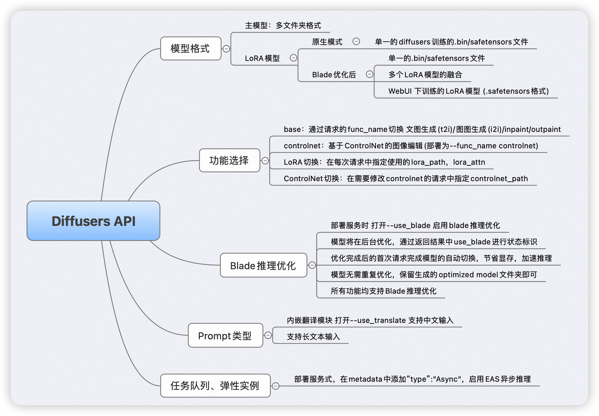

# Service for diffusers api

## 项目概述

本项目提供了基于PAI-EAS的[diffusers api](https://github.com/huggingface/diffusers) 云服务实现。




经PAI-Blade优化后，显著提升模型推理性能:
(A10 显卡)
| **image size** | **sample steps** | **Time of Pytorch(s)** | **Time of PAI-Blade(s)** | **speedup** | **Pytorch memory(GB)** | **PAI-Blade memory(GB)** |
| -------------- | ---------------- | ---------------------- | ------------------------ | ----------- | ---------------------- | ------------------------ |
| 1024x1024      | 50               | OOM                    | 14.36                    | -           | OOM                    | 5.98                     |
| 768x768        | 50               | 14.88                  | 6.45                     | 2.31X       | 15.35                  | 5.77                     |
| 512x512        | 50               | 6.14                   | 2.68                     | 2.29X       | 6.98                   | 5.44                     |


### 功能概览

您可以参考本项目实现：

- 直接基于本项目提供镜像，在PAI-EAS上部署已支持功能的服务。已支持的主流功能如下：

  (在服务部署时通过指定--func_name 进行不同类型的服务部署)

  - base服务 (通过请求时的func_name参数指定)
    - 文生图t2i/图生图i2i/图像inpaint/图像outpaint
  - controlnet服务
    - 基于ControlNet的端到端图像编辑
    - ControlNet的在线切换
  - LoRA模型的添加/修改
    - post时 通过指定lora_path，lora_attn 使用LoRA模型

- 参考项目源码，快速进行二次开发，部署实现任意的diffusers api服务。


### Features

- 基于PAI-Blade 进行推理优化

  -  降低 Text2Img、Img2Img 推理流程的端到端延迟 2.3 倍，同时可显著降低显存占用，超过TensorRT-v8.5等业内SOTA优化手段

- 扩展和兼容diffusers API和Web UI，以适配社区可下载的模型

  - 支持多个LoRA模型的融合，及sd-script训练的LoRA模型（civitai等第三方网站下载的模型），LoRA模型的在线切换

- 基于PAI-EAS，提供异步推理及弹性调度能力

- 内置翻译模型，支持中/英文prompt输入

- 简单的API实现，方便进行二次开发


### WebUI
⚠️ 项目提供了EAS上部署SD model服务的自定义实践，对SD-WebUI具有一定的兼容性，相比SD-WebUI的api更适合二次开发。

您亦可参考[WebUI使用文档](https://alidocs.dingtalk.com/i/nodes/R1zknDm0WR6XzZ4Lt1aQewElWBQEx5rG)，在PAI-EAS部署基于SDWEBUI的前/后端服务。

PAI-SDWEBUI解决方案为您提供了：

- 快捷部署，开箱即用
  - 获取阿里云账号后，5分钟即可完成单机SD WEBUI部署，获取webui 网址，具备与PC机使用完全一致的体验
  - 预置常用插件，热门开源模型下载加速
  - 底层资源动态切换，根据需求随时置换GU30、A10、A100等多种GPU
- 企业级功能
  - 前后端分离改造，支持多用户对多GPU卡的集群调度（如10个用户共用3张卡）
  - 支持按阿里云子账号识别用户身份，隔离使用的模型、输出图片，但共享使用的webui网址、gpu算力
  - 支持账单按工作室、集群等方式拆分
- 插件及优化
  - 集成PAI-blade性能优化工具，启用后，图片生成速度较原生WEBUI 有2-3倍的提升，较启用xformer优化有20%-60%的提升，且对模型效果无损
  - 提供filebrowser插件，支持用户在PC电脑上传下载云端模型、图片
  - 提供自研modelzoo插件，支持开源模型下载加速，模型维度的prompt、图片结果、参数的管理功能。
  - 支持企业用户使用时，插件集中化管理、用户个性化自定义使用两种形式


## 快速开始

### Step1: 环境搭建。

您可使用预置镜像或通过[Dockerfile](./diffusers/Dockerfile)自行搭建。(目前Blade推理优化仅支持A10/A100显卡，及PAI上推出的GU系列显卡)

 ```bash
  # EAS部署时 根据您所部署服务的region的不同 region可替换为hangzhou/shanghai等 该镜像下载自带加速 服务部署快
  eas-registry-vpc.cn-{region}.cr.aliyuncs.com/pai-eas/diffuser-inference:2.2.1-py38-cu113-unbuntu2004-blade-public

  # 公开镜像
  registry.cn-shanghai.aliyuncs.com/pai-ai-test/eas-service:2.2.1-py38-cu113-unbuntu2004-blade-public
 ```

### Step2: 服务开发/部署。

- 自定义processor开发

  - 您可修改预测服务主文件[app.py](./diffusers/app.py) 进行自定义processor的开发。[这里](./doc/app.md)我们简单梳理本服务的流程，便于您进行二次开发。

  - 更多PAI-EAS的自定义processor开发请参考[官方文档](https://help.aliyun.com/document_detail/143418.html?spm=a2c4g.130248.0.0.3c316f27SLZN0o)。


- 服务部署


  - 以提供的app.py 为例，请参考 [部署文档](./doc/deploy.md) 在PAI-EAS 进行服务部署。部署完成后，您可以进行服务调用。


   - 本地服务部署测试可直接运行 (更多命令参数请参考 [部署文档](./doc/deploy.md) 的详细说明)

     ```bash
     # 使用 --local_debug 开启本地测试
     # 本地测试时 --model_dir 指定模型位置 --save_dir 指定出图位置 (EAS部署时 通过json挂载指定，无需额外输入)
     # 本地测试时 --oss_save_dir --region参数用于生成保存的oss链接，可忽略（任意输入）
     # --func_name base/controlnet
     # 本地调试请加入 export BLADE_AUTH_USE_COUNTING=1 我们提供了一定次数的试用权限。您可再PAI上无限次使用PAI-Blade推理优化。
     python /home/pai/app.py --func_name base --oss_save_dir oss://xxx --region hangzhou --model_dir=your_path_to_model --save_dir=your_path_to_output --use_blade --local_debug
     ```


### Step3: 服务调用。

**接口定义**：[param.md](./doc/param.md)

**同步调用：**

base服务调用：[sync_example_base.py](./diffusers/example/sync_example_base.py)

controlnet服务调用：[sync_example_control.py](./diffusers/example/sync_example_control.py)

**异步调用：**

对于aigc而言，通常推理时间较长，同步返回结果易超时。

可部署EAS异步服务，调用时分别 发送请求 和 订阅结果。

- 服务部署时，设置

```json
"metadata": {
    "type": "Async"
},
```

以python SDK为例，可参考以下脚本，更多EAS异步推理SDK见：[参考文档](https://help.aliyun.com/document_detail/446942.html)

发送请求：[async_example_post.py](./diffusers/example/async_example_post.py)

订阅结果：[async_example_get.py](./diffusers/example/async_example_get.py)

⚠️：异步推理暂时不支持使用base64进行图像返回。
