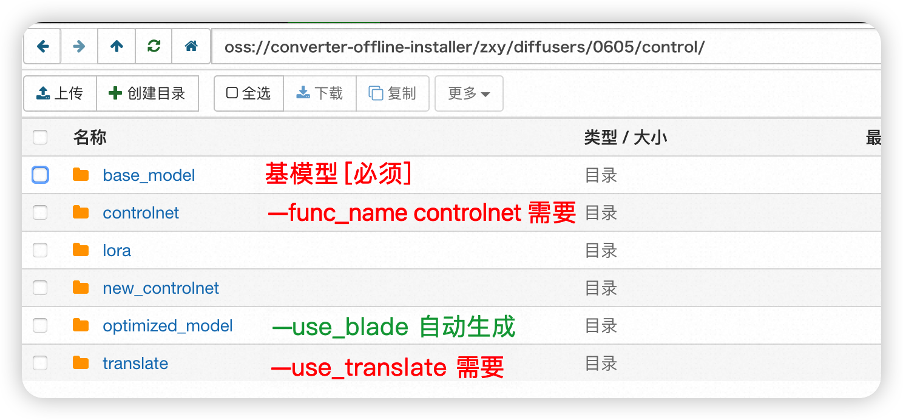
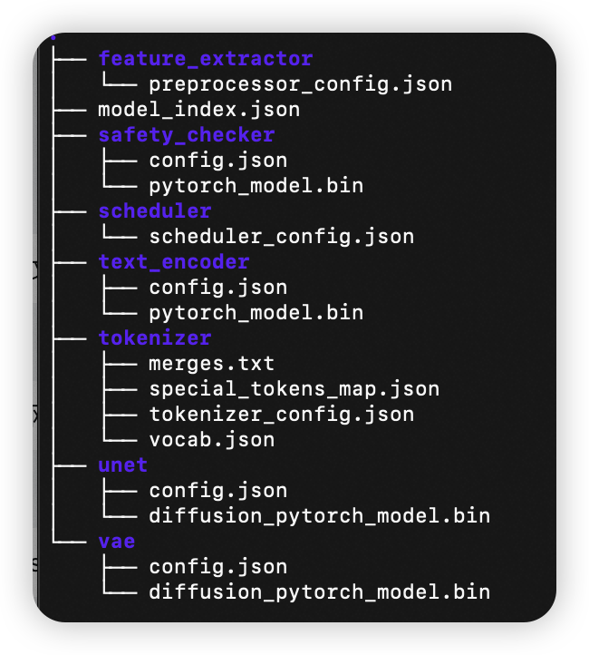
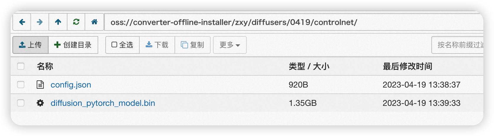
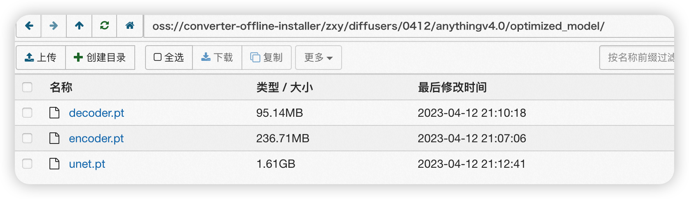
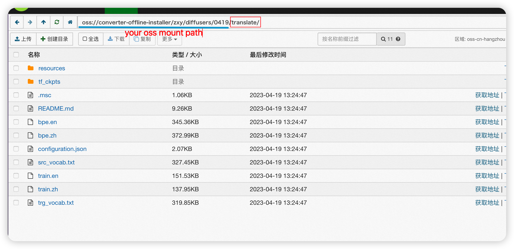
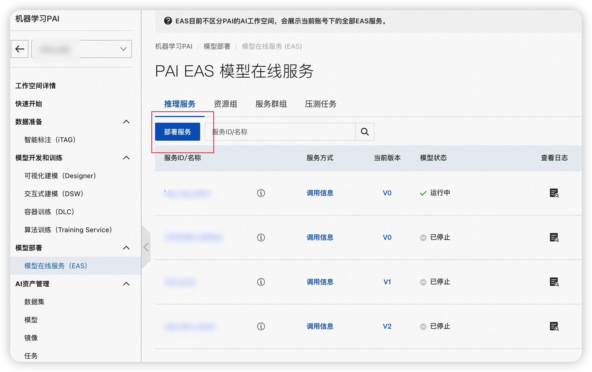

### 部署文档

通过[PAI-EAS](https://help.aliyun.com/document_detail/113696.html?spm=a2c4g.113696.0.0.2c421af2NqTtmW)，您可以将模型快速部署为RESTful API，再通过HTTP请求的方式调用该服务。PAI-EAS提供弹性扩缩容、版本控制及资源监控等功能，便于将模型服务应用于业务。

本文档介绍了如何在PAI-EAS，使用给定镜像部署基于diffusers的服务。我们使用自定义镜像部署+oss挂载的方式进行服务部署。在二次开发后，您可修改镜像并参考本文档部署自定义的服务。

#### 前提条件

在开始执行操作前，请确认您已完成以下准备工作。

- 已开通PAI（DSW、EAS）后付费，并创建默认工作空间，具体操作，请参见[开通并创建默认工作空间](https://help.aliyun.com/document_detail/326190.htm#task-2121596)。
- 已创建OSS存储空间（Bucket），用于存储数据集、训练获得的模型文件和配置文件。关于如何创建存储空间，详情请参见[创建存储空间](https://help.aliyun.com/document_detail/31885.htm#task-u3p-3n4-tdb)。


#### 步骤一：模型准备

准备好所需加载的模型文件，并上传至自己的oss bucket。

- 将主模型所需文件均存在指定oss bucket的base_model文件夹中【必须】
- ControlNet相关模型放在controlnet文件夹中【可选】
- 讲预置的翻译模型放入translate文件夹中【可选】



- base_model 文件夹支持下列格式：

  - diffusers api支持的多文件夹格式 （单个的.safetensors/.ckpt文件将自动转化）




- controlnet文件夹需包含下列文件【使用controlnet时必须】



- optimized_model文件夹需包含以下三个/四个文件（controlnet会生成额外的controlnet.pt）。在部署服务时打开--use_blade开关，Blade模型将自动在后台优化，优化完成后自动进行模型替换



- translate文件夹，您可通过下方链接下载模型文件内置翻译模型。【可选】

  - 模型下载地址：https://www.modelscope.cn/models/damo/nlp_csanmt_translation_zh2en/files
  - 参考下载链接：https://pai-vision-exp.oss-cn-zhangjiakou.aliyuncs.com/zxy/model/damo_translate.tar.gz




#### 步骤二：模型部署

在模型准备完成后，可利用EAS进行服务的部署。您可以根据需要及时调整部署命令，以部署不同类型的服务。

具体地，您需要进行执行以下步骤：

- **Step1：创建EAS服务**



- **Step2：选择镜像部署并修改相应的参数**

  - ”对应配置编辑“处，复制下列配置文件，并修改相应的参数

 ```json
  {
      "cloud": {
          "computing": {
              "instance_type": "ml.gu7i.c8m30.1-gu30"
          }
      },
      "containers": [
          {
              "command": "python /home/pai/app.py  --func_name base --oss_save_dir oss://converter-offline-installer/zxy/diffusers/0605/ --region hangzhou --use_blade --use_translate",
              "image": "eas-registry-vpc.cn-hangzhou.cr.aliyuncs.com/pai-eas/diffuser-inference:2.2.1-py38-cu113-unbuntu2004-blade-public"
          }
      ],
      "features": {
          "eas.aliyun.com/extra-ephemeral-storage": "100Gi"
      },
      "metadata": {
          "cpu": 8,
          "gpu": 1,
          "instance": 1,
          "memory": 30000,
          "name": "diffuser_base_ch_async",
          "rpc": {
              "keepalive": 500000
          },
          "type": "Async"
      },
      "name": "diffuser_base_ch_async",
      "storage": [
          {
              "mount_path": "/oss",
              "oss": {
                  "path": "oss://converter-offline-installer/zxy/diffusers/0605/base/"
              }
          },
          {
              "mount_path": "/result",
              "oss": {
                  "path": "oss://converter-offline-installer/zxy/diffusers/0605/"
              }
          }
      ]
  }
  ```

  - containers.command 命令

| key             | value                 | 说明                                 |
| --------------- | --------------------- | ------------------------------------ |
| --func_name     | base                  | 同时支持t2i/i2i/inpaint/outpaint功能 |
|                 | controlnet            | 进行基于ControlNet的图像编辑         |
| --oss_save_dir  | oss://xxx             | 保存图片的oss路径                    |
| --region        | hangzhou/shanghai/... | 服务部署所在区域的拼音全称           |
| --use_blade     | —                     | 启用Blade推理优化功能                |
| --use_translate | —                     | 加载翻译模型支持中文prompt输入       |

  - containers.image：替换杭州为服务部署所在的reigon

  - metadata.name / name 修改为任意的服务名称

  - metadata.type 设置为 Async表示 部署异步服务 （同步服务无需添加该项）

  - storage 处 添加 模型和生成结果的oss路径挂载

    - mount_path 不可修改 / 或修改镜像中的对应代码

    | mount_path | oss       | 说明                 |
    | ---------- | --------- | -------------------- |
    | /oss       | oss://xxx | 所挂载的模型路径     |
    | /result    | oss://xxx | 所挂载的生成图片位置 |

 - 点击“部署”按钮，等待服务部署完成即可。


 - 点击上图的调用信息获得 测试所需的：

```json
hosts = 'xxx'
head = {
    "Authorization": "xxx"
}
```
